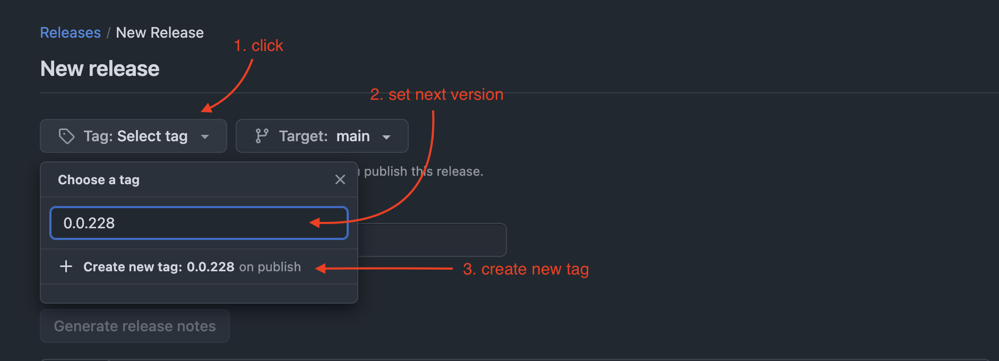
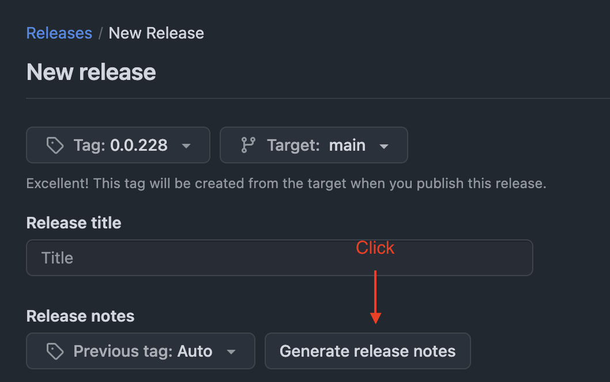
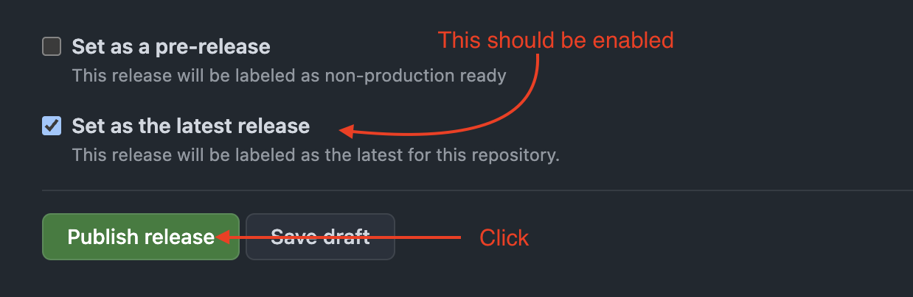

# How to create new release and publish a new Click-UI package version to NPM

1. Navigate to the [Release page](https://github.com/ClickHouse/click-ui/releases) and check the latest release. It might already contain the changes you need, making a new version unnecessary.
2. Draft a [new release](https://github.com/ClickHouse/click-ui/releases/new).
3. Create a tag for the release. The new version should be an increment from the latest released version. 
4. Generate release notes. 
5. Publish the release. 
6. Wait until the [GitHub Actions](https://github.com/ClickHouse/click-ui/actions) complete.
7. Verify that the new version is published on [npm](https://www.npmjs.com/package/@clickhouse/click-ui).
