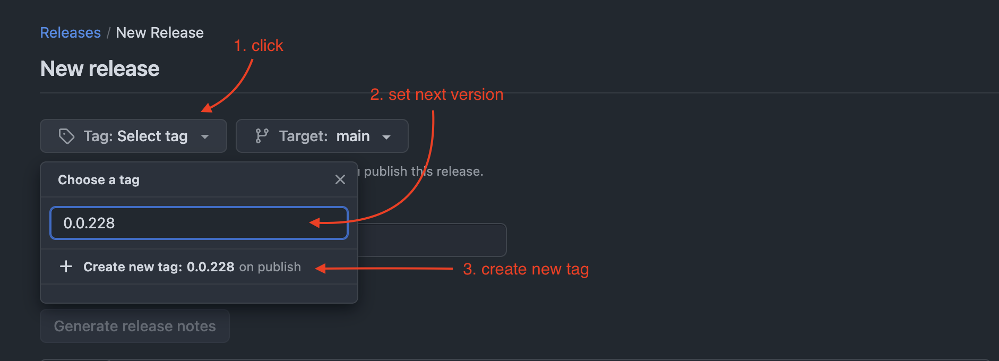
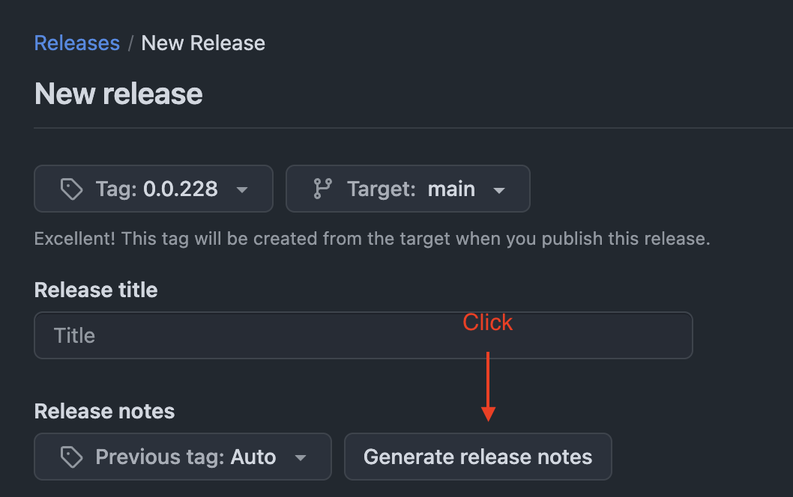
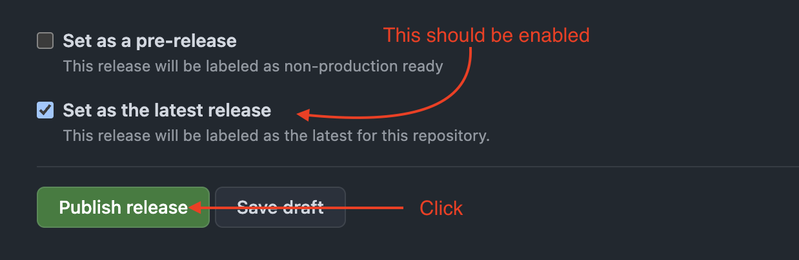

# How to create new release and publish a new Click-UI package version to NPM

> [!WARNING]
> The npm dist-tag is derived from the version in the tag (`.scripts/bash/npm-dist-tag-for-version`):
> `vX.Y.Z` publishes to `latest` and must be newer than the current `latest` on npm;
> `vX.Y.Z-rc1` (or `-rc.1`, `-beta1`) publishes to `rc`; `-alpha1` to `alpha`.
> Any other suffix (`-next1`, `-test1`, ...) fails the workflow before anything is built; nothing falls back to `latest`.
> Tick "Set as a pre-release" for rc/alpha versions and leave it unticked for `latest`. The workflow fails when the checkbox and the version disagree.

> [!NOTE]
> The `beta` dist-tag is retired: it was removed from npm and is never written again. Consumers on `@beta` should switch to `@rc`.
> `-canary.*` versions are reserved for the upcoming automated canary releases; do not create canary tags by hand.

1. Navigate to the [Release page](https://github.com/ClickHouse/click-ui/releases) and check the latest release. It might already contain the changes you need, making a new version unnecessary.
2. Draft a [new release](https://github.com/ClickHouse/click-ui/releases/new).
3. Create a tag for the release. The new version should be an increment from the latest released version. Use `vX.Y.Z` for a release or `vX.Y.Z-rc1` for a release candidate. 
4. Generate release notes. 
5. Publish the release. 
6. Wait until the [GitHub Actions](https://github.com/ClickHouse/click-ui/actions) complete. A rejected release shows the reason in the run summary.
7. Verify that the new version is published on [npm](https://www.npmjs.com/package/@clickhouse/click-ui).

## Known limitations

- `latest` only moves forward. A patch for an older release line (for example `v0.10.1` after `v0.11.0`) is refused. There is no override yet; add one to the workflow when it is first needed.
- Publishes run one at a time. If a third release is published while another is still waiting, GitHub cancels the waiting one; re-run it from the Actions tab.
- A release with the wrong "pre-release" checkbox cannot be re-run with the fix: delete the release and re-create it for the same tag.
